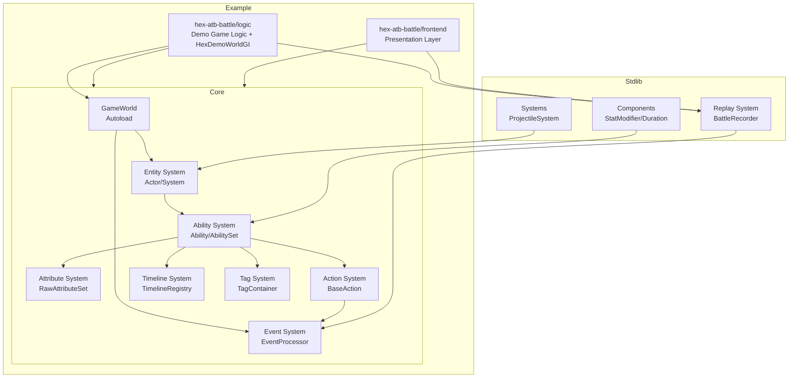

# Logic Game Framework — Architecture Overview

Godot 回合制 / ATB 战斗框架的核心模块依赖与数据流总览。

此文档聚焦**架构级视图**（模块依赖、关键数据流、配置归属）。设计铁律、Action 分层契约、World-owns-Battle 架构、未来规划见 [`docs/README.md`](docs/README.md)；单个系统 API 细节见对应源码头部注释与 `docs/reference/`。

---

## Core Module Dependencies



## Key Data Flows

### 1. Ability Execution Flow
```
User Input → AbilityComponent.on_event()
    ↓ Check Triggers/Conditions/Costs
AbilityExecutionInstance.tick()
    ↓ Timeline keyframe triggers
Action.execute()
    ↓ Pre-Event processing (damage reduction/immunity)
Atomic operations (push event + apply state)
    ↓ Post-Event processing (thorns/lifesteal)
EventCollector collects (replay recording)
```

### 2. Attribute Modification Flow
```
StatModifierComponent.on_apply()
    ↓ Create AttributeModifier
RawAttributeSet.add_modifier()
    ↓ Mark dirty
Actor accesses attribute
    ↓ get_current_value()
AttributeCalculator.calculate()
    ↓ 4-layer formula calculation
Return AttributeBreakdown
```

### 3. Event Processing Flow
```
Action pushes event
    ↓
EventProcessor.process_pre_event()
    ↓ Iterate Pre Handlers
    ↓ Collect Intent (PASS/MODIFY/CANCEL)
    ↓ Apply modifications
MutableEvent returned
    ↓ Action checks if cancelled
EventProcessor.process_post_event()
    ↓ Broadcast to all alive Actors
    ↓ Trigger passive abilities
EventCollector.push()
```

---

## Configuration Placement (where does X go?)

| Config kind | Where | Example |
|---|---|---|
| Cast eligibility (cast 前过滤: range / faction / target kinds / LOS) | **ability metadata** + declarative query (e.g. `can_use_skill_on`) | `HexBattleSkillMetaKeys.RANGE` |
| Reactive event filter (事件到达时该不该响应) | **Condition** | `HasTagCondition` |
| Physical params (push / blocks_path) | plain data field | `CollisionProfile` |
| Action behavior (打谁 / 打多少) | Action subclass | `DamageAction` |
| Resource cost | Cost subclass | `MpCost` |

**Cast eligibility 不进 Condition** — AI / UI / tooltip 需要事前查询配置，Condition 只在事件到达时跑，不是 declarative 入口。详见 `enforcing-lgf` skill 的 `reference/cast-eligibility-vs-condition.md`。

---

## 源代码注释边界

- **只讲现状**，不讲"取代旧 XXX"、"原来是 callback 方案" 这类历史轨迹。历史归 `CHANGELOG.md`。
- 写 **why**（不变量 / 反直觉的约束 / 被某个 bug 驱动过的设计），不写 **what**（用良好命名表达）。
- 变更追溯入口是 `CHANGELOG.md`（[Keep a Changelog](https://keepachangelog.com/) 格式，`[Unreleased]` 段按 Added / Changed / Fixed / Removed 分类）。

## 更多文档

- 设计铁律 / World-owns-Battle 架构 / 未来规划 / 已知债务 → [`docs/README.md`](docs/README.md)
- Action 四层分层契约 + 各机制边界 → [`docs/reference/action-architecture.md`](docs/reference/action-architecture.md)
- Action 基类 / 构造规范 → [`docs/reference/action-system.md`](docs/reference/action-system.md)；目标选择 → [`docs/reference/target-selector.md`](docs/reference/target-selector.md)
- 示例：[`example/hex-atb-battle/`](example/hex-atb-battle/)（回合制 + hex grid）、[`example/dota2-auto-battle/`](example/dota2-auto-battle/)
