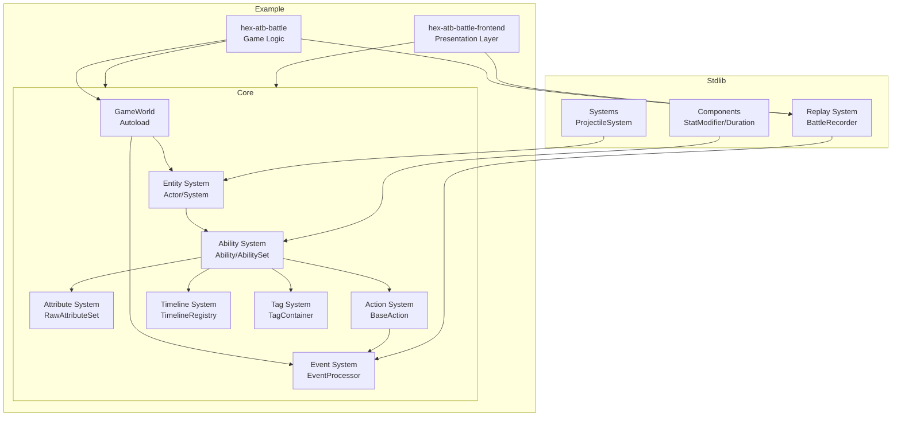

# Logic Game Framework — Architecture Overview

Godot 回合制 / ATB 战斗框架的核心模块依赖与数据流总览。

此文档聚焦**架构级视图**（模块依赖、关键数据流）；单个系统的 API 细节请参考对应源码头部注释与 `docs/` 目录。

---

## Core Module Dependencies



## Key Data Flows

### 1. Ability Execution Flow
```
User Input → AbilityComponent.on_event()
    ↓ Check Triggers/Conditions/Costs
AbilityExecutionInstance.tick()
    ↓ Timeline keyframe triggers
Action.execute()
    ↓ Pre-Event processing (damage reduction/immunity)
Atomic operations (push event + apply state)
    ↓ Post-Event processing (thorns/lifesteal)
EventCollector collects (replay recording)
```

### 2. Attribute Modification Flow
```
StatModifierComponent.on_apply()
    ↓ Create AttributeModifier
RawAttributeSet.add_modifier()
    ↓ Mark dirty
Actor accesses attribute
    ↓ get_current_value()
AttributeCalculator.calculate()
    ↓ 4-layer formula calculation
Return AttributeBreakdown
```

### 3. Event Processing Flow
```
Action pushes event
    ↓
EventProcessor.process_pre_event()
    ↓ Iterate Pre Handlers
    ↓ Collect Intent (PASS/MODIFY/CANCEL)
    ↓ Apply modifications
MutableEvent returned
    ↓ Action checks if cancelled
EventProcessor.process_post_event()
    ↓ Broadcast to all alive Actors
    ↓ Trigger passive abilities
EventCollector.push()
```

---

## Documentation Conventions

addon 里的变更追溯分两层：

### `CHANGELOG.md` — 变更入口，一条一项

- 遵循 [Keep a Changelog](https://keepachangelog.com/) 格式：`[Unreleased]` 段下按 **Added / Changed / Fixed / Removed / Deprecated** 分类。
- 重大轮次（有明确架构主题）开新子段 `## [Unreleased] — YYYY-MM-DD 主题`，把本轮条目聚拢在一起。小改动直接追加到最近的 `[Unreleased]` 段末。
- 每条写清楚 **API 变化** 和 **why**（修复 / 对齐 / 收敛了什么）。不解释 how — how 归 design note。
- 若涉及数字对比，末尾附验证表：`| 测试 | Before | After |`。
- 条目末尾可带 `→ [design-notes/YYYY-MM-DD-xxx.md](docs/design-notes/YYYY-MM-DD-xxx.md)` 指向长文。
- 未完成但相关的问题放 `### 待处理` 段，便于下一轮接手。

### `docs/design-notes/` — 架构推理长文

命名 `YYYY-MM-DD-<topic>.md`。**只在有非 trivial 设计取舍时写**（例：循环根治、API 重塑、范式迁移）。普通 bug 修复不写。

推荐结构：
- **范围 / 前置**：涉及的文件 + 依赖的前轮决策
- **背景**：问题现象，上轮遗留的 handoff 指向什么
- **定位**：怎么 probe 到根因（PREDELETE probe / weakref 追踪 / 假设验证实验）
- **根因**：精确到行号的引用关系图
- **架构决策**：讨论过的候选方案 + 否决原因 + 为什么选当前方案
- **实现**：关键代码片段（before/after），不完整拷贝代码，只贴决策相关的核心
- **验证**：基线 → 修复后的数字对照
- **方法论总结**：从这次事件中固化下来的通用规则（未来同类问题怎么认）
- **遗留**：识别出但不在本轮范围的同类风险

### 源代码注释的边界

- **只讲现状**，不讲"取代旧 XXX"、"原来是 callback 方案" 这类历史轨迹。历史归 CHANGELOG 和 design note。
- 写 **why**（不变量 / 反直觉的约束 / 被某个 bug 驱动过的设计）：比如 `循环依赖保护复用 _computing_set 机制：...`。
- 不写 **what**（用良好命名表达）：比如不写 `# 遍历所有 clamp 并应用`。

### 典型流程

修完代码 → `CHANGELOG.md` 加条目（小改动写完就够了）→ 若是架构级变更，顺手写 `docs/design-notes/` → 源代码注释只留「现状 + 必要的 why」→ commit（submodule 先，主仓库 bump pointer 后）。

参考样本：
- 循环 C/D/E：`docs/design-notes/2026-04-19-structural-cycles-weakref.md`
- cross-attr clamp：`docs/design-notes/2026-04-19-attribute-cross-clamp-config-driven.md`