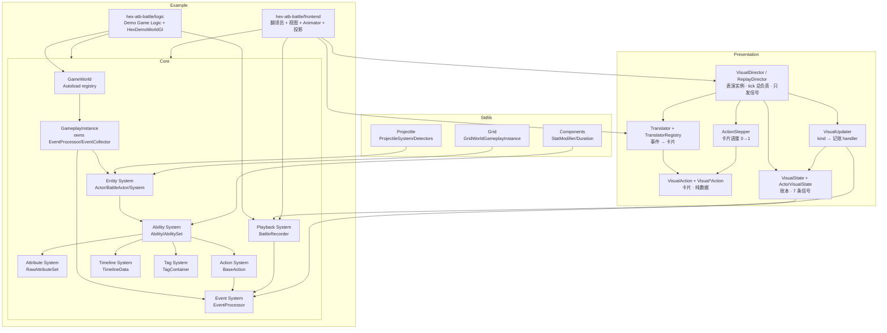

# Logic Game Framework — Architecture Overview

Godot 回合制 / ATB 战斗框架的核心模块依赖与数据流总览。

此文档是 LGF **架构与设计铁律**的唯一真相（两个规则之家之一；编码规则在主仓 `.claude/skills/enforcing-lgf/SKILL.md`）。单个系统的 API 细节看对应源码头部注释与 `tests/`，不另写参考文档。

---

## Core Module Dependencies


```mermaid
graph TB
    subgraph "Core"
        World[GameWorld<br/>Autoload registry]
        Instance[GameplayInstance<br/>owns EventProcessor/EventCollector]
        Entity[Entity System<br/>Actor/BattleActor/System]
        Attributes[Attribute System<br/>RawAttributeSet]
        Abilities[Ability System<br/>Ability/AbilitySet]
        Events[Event System<br/>EventProcessor]
        Actions[Action System<br/>BaseAction]
        Timeline[Timeline System<br/>TimelineData]
        Tags[Tag System<br/>TagContainer]
        Playback[Playback System<br/>BattleRecorder]
    end

    subgraph "Stdlib"
        Components[Components<br/>StatModifier/Duration]
        Projectile[Projectile<br/>ProjectileSystem/Detectors]
        Grid[Grid<br/>GridWorldGameplayInstance]
    end

    subgraph "Presentation"
        Director[VisualDirector / ReplayDirector<br/>表演实例 · tick 总负责 · 只发信号]
        Translators[Translator + TranslatorRegistry<br/>事件 → 卡片]
        Cards[VisualAction + Visual*Action<br/>卡片 · 纯数据]
        Stepper[ActionStepper<br/>卡片进度 0→1]
        State[VisualState + ActorVisualState<br/>账本 · 7 条信号]
        Updater[VisualUpdater<br/>kind → 记账 handler]
    end

    subgraph "Example"
        Core[hex-atb-battle/core<br/>Shared Events + WorldGI base]
        HexDemo[hex-atb-battle/logic<br/>Demo Game Logic + HexDemoWorldGI]
        Frontend[hex-atb-battle/frontend<br/>翻译员 + 视图 + Animator + 投影]
    end

    World --> Instance
    Instance --> Entity
    Instance --> Events
    Entity --> Abilities
    Abilities --> Attributes
    Abilities --> Tags
    Abilities --> Actions
    Abilities --> Timeline
    Actions --> Events
    Components --> Abilities
    Projectile --> Entity
    Grid --> Entity
    Playback --> Events
    HexDemo --> World
    HexDemo --> Core
    HexDemo --> Playback
    Director --> Translators
    Director --> Stepper
    Director --> State
    Director --> Updater
    Translators --> Cards
    Stepper --> Cards
    Updater --> State
    State --> Playback
    Updater --> Events
    Frontend --> Core
    Frontend --> Playback
    Frontend --> Director
    Frontend --> Translators
```

## Key Data Flows

### 1. Ability Execution Flow
```
User Input → AbilityComponent.on_event()
    ↓ Check Triggers/Conditions/Costs
AbilityExecutionInstance.tick()
    ↓ Timeline keyframe triggers
Action.execute()
    ↓ Pre-Event processing (damage reduction/immunity)
Atomic operations (push event + apply state)
    ↓ Post-Event processing (thorns/lifesteal)
instance.event_collector collects (replay recording)
```

### 2. Attribute Modification Flow
```
StatModifierComponent.on_apply()
    ↓ Create AttributeModifier
RawAttributeSet.add_modifier()
    ↓ Mark dirty
Actor accesses attribute
    ↓ get_current_value()
AttributeCalculator.calculate()
    ↓ 4-layer formula calculation
Return AttributeBreakdown
```

### 3. Event Processing Flow
```
Action pushes event
    ↓
EventProcessor.process_pre_event()
    ↓ Iterate Pre Handlers of that kind
    ↓   event_filter (event + 3 ids, no context) → rebuild context → context_filter → handler
    ↓ Collect Intent (PASS/MODIFY/CANCEL)
    ↓ Apply modifications
MutableEvent returned
    ↓ Action checks if cancelled
EventProcessor.process_post_event()
    ↓ Iterate registrations of that kind
    ↓   event_filters (event + 3 ids, no context) → rebuild context, gated by Actor.is_event_responsive → context_filter → actions
    ↓ Trigger passive abilities
instance.event_collector.push()
(deliver_to_ability: by address, only .direct() triggers, no registry lookup — see 设计铁律)
```

---

## Configuration Placement (where does X go?)

| Config kind | Where | Example |
|---|---|---|
| Cast eligibility (cast 前过滤: range / faction / target kinds / LOS) | **ability metadata** + declarative query (e.g. `can_use_skill_on`) | `HexBattleSkillMetaKeys.RANGE` |
| Reactive event filter (事件到达时该不该响应) | **Condition** | `HasTagCondition` |
| Physical params (push / blocks_path) | plain data field | `CollisionProfile` |
| Action behavior (打谁 / 打多少) | Action subclass | `DamageAction` |
| Resource cost | Cost subclass | `MpCost` |

**Cast eligibility 不进 Condition** — AI / UI / tooltip 需要事前查询配置，Condition 只在事件到达时跑，不是 declarative 入口。详见 `enforcing-lgf` skill 的 `reference/cast-eligibility-vs-condition.md`。

**已配置 Condition/Cost 的 cast 前复核走 `AbilitySet.can_activate`**（激活门纯查询干跑，零副作用，返回 `{allowed, reason, failed_component_type}`，见 `AbilityActivationQuery`）——UI/AI/tooltip 复用同一份门控真相，既不 dry-run cast 流程，也不在业务层复刻冷却/资源规则；它不是把 cast 过滤搬进 Condition 的理由，metadata 路径照旧。

---

## World owns Battle

- **世界永续、战斗是过程**：`WorldGameplayInstance` 是一局游戏的载体（actor registry / systems 归它；hex 棋盘归 stdlib 子类 `GridWorldGameplayInstance`），期间发生任意多场战斗；战斗是短命的 `BattleProcedure`，**借用** world 里的 actor 而非 spawn，tick 期间直接改 actor 属性即等于写 world，结束即释放。判别标准：有状态、被外界引用的是 **Instance**；输入 → 输出 → 丢弃、中间无人引用的是 **Procedure**。战斗推进统一走 `WorldGameplayInstance.tick(dt)`：有未完成战斗时本帧独占给战斗（`BATTLE_TICKS_PER_WORLD_FRAME` 默认 INT_MAX，退化成一帧跑完），否则推世界 system；参战者打 `in_combat` tag 让 world-level system 跳过。
- **前端只观察 world**：`bind_world(world)` 一次性 hydrate 全部 actor，再订阅 mutation signal（`actor_added` / `actor_removed` / `grid_configured`）维护 view；属性变化（HP / tag）不走 signal，由 animator 消费录像 timeline 驱动表演。
- **录像**：`BattleProcedure` 持短命 `BattleRecorder`，事件统一汇入所属 world 的 `event_collector` 单队列；`finish()` 的返回值就是录像 dict `{meta, world_snapshot, timeline}`，无 version 字段（录像是短命数据，不做多版本共存；坏文件由 `BattleRecord.from_dict` 的必需字段检查直接 crash，不静默播空场）。`world_snapshot` 由世界侧 `capture_world_snapshot()` 产出、范围由 `should_record_actor()` 裁定（常驻世界借此排除 overworld 实体），recorder 只接收注入。存档序列化（`to_dict`）与录像快照是两套各有语义的 actor→dict，不合并：回放器没有规则引擎，需要含派生值的自足快照。播放侧两层命名：A 层 `Playback`（现役，只从录像 spawn 视觉 view）；B 层 `Replay`（deterministic 重算，未来不一定做，仅命名占位）。
- **一场录像自洽**：录像内容只取决于本场——`_start_recorder()` 开录前丢弃 world collector 里的旧事件（常驻世界两场之间推进去的），`finish()` 停录前把收尾产生的事件（清 `in_combat` 的 `TagChanged`）录进最后一帧（`record_frame` 同帧号并进已有 FrameData：播放侧按帧号一帧一条）。中途离场的 actor 经 `actor_removed` 当场退订，此后它的变化不再进录像；`ActorDestroyed` 由 actor 自己的 despawn 订阅推一条，`BattleRecorder.unregister_actor` 只释放订阅、不推事件。`AbilityGranted` 的 payload 就是 `ability.serialize()`，实例 id 在 `id` 键下（与后续事件的 `ability_instance_id` 同值）。

## Presentation layer（`presentation/`，adr/0013）

三层架构的第三层物理落地：`core/` → `stdlib/` → `presentation/` → `example/`。`presentation/` 只依赖 core 的 `PlaybackData` / `GameEvent`，不依赖 `stdlib/`、`example/`、ultra-grid-map（`tests/presentation/presentation_lint_test.gd` 钉禁词与依赖方向）。框架件无前缀；项目件带项目前缀（hex `Frontend*`、inkmon `InkMon*`）——看前缀就知道是不是框架件。管线一句话：**逻辑事件 → 翻译员 → 卡片 → 步进器 → 账本（更新器记账）→ 信号 → 项目 view**。

### 词表（`presentation/core/` + `presentation/actions/`）

| 件 | 一行职责 |
|---|---|
| `VisualDirector`（抽象 Node）/ `ReplayDirector` | 表演实例，tick 总负责：持 registry / stepper / state / updater 四件（`_init(registry, animation_config = null)` 建、`_exit_tree` 断连置空），`pump(delta_ms, events)` 是共享 tick 体，只发信号不持 view。`ReplayDirector` 加帧时钟：`load_playback(record)` 摊帧表（`tick_ms` 取 `meta.tick_interval`，≤ 0 退回 100；帧 0 = 开战台面，事件从帧 1 起）+ `play / pause / toggle / reset / step / set_speed / is_playing / is_ended / get_current_frame / get_total_frames` + `playback_state_changed / frame_changed / playback_ended`；录像帧播完继续 pump 到步进器排空才 `playback_ended`（只报一次；没有录像时 `play` / `reset` / `step` 无动作）。live 项目直接继承 `VisualDirector`，自己攒本帧事件调 `pump` |
| `Translator` + `TranslatorRegistry` | 翻译员：`can_handle(event)` + `translate(event, query) -> Array[VisualAction]`，纯函数、只读 `VisualStateQuery`；注册表 collect-all（一条事件可由多个翻译员各出卡片，`register` 可链式）。事件方言（kind 名 / 字段）由项目定，框架不认识任何一种 |
| `VisualAction` + 内置 `Visual*Action` | 卡片：一条事件翻出来的一段声明式表演（做什么，不是怎么做），纯数据、`delay` / `duration` 毫秒、位置一律逻辑平面 `Vector2`。`kind: StringName` 开放，内置 11 种常量在 `VisualAction` 上：`move` / `hp_delta` / `floating_text` / `procedural_vfx` / `death` / `attack_vfx` / `projectile` / `buff_state` / `shield_state` / `bump` / `facing_state` |
| `ActionStepper` | 步进器：卡片入队后并行按 `delay` / `duration` 走 0→1，`tick(delta_ms) -> TickResult{active_actions, completed_this_tick, has_changes}`，完成即出表；只管「何时走到什么进度」，不管「执行什么」。live 入口 `cancel_for_actor` / `has_actor_action` |
| `VisualState` + `ActorVisualState` + `VisualStateQuery` | 账本：每个进入过表演的逻辑 actor 一条 `ActorVisualState`（位置 / `visual_hp` · `target_hp` · `max_hp` / `is_alive` / flash · tint / `buffs` · `shields` / bump / facing）、在飞插值、一次性效果簿（`kind → {id → VisualEffectPayload.Effect}`）、程序化效果与震屏、账本时间；只持数据、出记账原语、发 7 条信号，不认识任何卡片种类。`VisualStateQuery` 是给翻译员的只读视图（`get_actor_position` 含在飞插值）。live 入口 `seed_actor` / `despawn_actor` / `set_actor_position` |
| `VisualUpdater` | 更新器（记账规则）：`kind → Callable` handler 表（内置 11 种默认登记，项目 `register_handler(kind, callable)`；未登记的 kind `assert_crash`），三个入口 `apply_actions(state, active)`（卡片 × 进度）/ `apply_event(state, event)`（事件直改：`actor_spawned` / `actor_destroyed` / `max_hp`，必须在翻译前落账本）/ `tick_time(state, delta_ms)`（到期效果清理 + `visual_hp` 追赶）；除 handler 表外无状态。handler 签名 `static func (state: VisualState, action: VisualAction, progress: float, action_id: String) -> void` |

附件：`AnimationConfig`（时长 / 缓动 / hp 追赶等参数，`create_default()`）· `BuffSummary` / `ShieldSummary`（账本上的 buff / 护盾摘要，`id` 取 ability 实例 id）· `VisualEffectPayload.*`（一次性效果 payload：`Effect` 底座 + `FloatingText` / `AttackVfx` / `Projectile` / `ProceduralEffect` / `ScreenShake`；项目私有效果种类自定义 `Effect` 子类）。

### `pump(delta_ms, events)` 的 8 步（`VisualDirector`，顺序不可调）

1. **事件直改** `updater.apply_event(state, event)`——每条事件先过账本 lifecycle（spawn / destroy / max_hp）
2. **翻译** `registry.translate(event, state.as_query())`——翻译员拿到的是直改后的只读视图
3. **入步进器** `stepper.enqueue(actions)`（1–3 逐事件按发生顺序做完再进 4）
4. **推进账本时间** `state.advance_time(delta_ms)`
5. **步进** `stepper.tick(delta_ms) -> TickResult`
6. **记账** `has_changes` 时 `updater.apply_actions(state, active_actions)` 再 `apply_actions(state, completed_this_tick)`——先活跃再完成，终值最后落账
7. **时间驱动** `updater.tick_time(state, delta_ms)`——到期效果出账 + `visual_hp` 追赶，与卡片无关、每趟都跑
8. **flush** `state.flush_dirty_actors()`——脏 actor 各广播一次 `actor_state_changed`

事件源播完后照样每趟调（空事件数组），让在飞卡片走完、hp 追赶收敛。

### 7 条信号（`VisualState` 发，Director 原样转发；view 只订阅 Director）

| 信号 | 何时 |
|---|---|
| `actor_state_changed(id, state)` | 台面重建时每个 actor 一次；之后 flush 时每个脏 actor 一次；`set_actor_position` / 销毁事件当场 |
| `actor_spawned(id, state)` | 中途入账（录像 `actor_spawned` 事件 / live `seed_actor`），随后紧跟一条 `actor_state_changed`；同 id 再入账返回 null 不广播 |
| `actor_died(id)` | transition-only：`is_alive` 真正 true→false 那一刻一次（`set_actor_alive` 是唯一出口） |
| `actor_despawned(id)` | live `despawn_actor` 出账；录像里的 `actor_destroyed` 只改状态（死亡 sticky + hp 归零）不出账、不发 |
| `effect_spawned(kind, payload)` | 一次性效果入账（内置 kind 的 payload 见 `VisualEffectPayload`） |
| `effect_updated(kind, id, progress, payload)` | progress 驱动的效果每次记账（payload 是账本里那条记录，当前值已写入） |
| `effect_removed(kind, id)` | handler 在完成时显式 `remove_effect`（attack_vfx / projectile）；到期静默忘记的（飘字 / overlay）不发，view 自管节点寿命 |

Event vs State 边界（hex `README.md`「设计铁律」同款）：能每帧重复且幂等的（HP 条 / 闪白 / 染色 / 位置 / buff / 盾）走 `actor_state_changed` 快照；重复会建节点 / 起 tween / 播音效的（死亡动画 / 一次性效果）走 transition-only 信号。

### 消费方接入清单（kards / 2e 的 inkmon）

1. bump submodule 到收口 SHA。
2. **事件源**：回放 → 继承 `ReplayDirector`，`load_playback(record)` 喂 `PlaybackData.BattleRecord`；live → 继承 `VisualDirector`，自己攒本帧事件 dict 后调 `pump(delta_ms, events)`。
3. **翻译员**：每种事件 kind 一个 `<Proj>XxxTranslator extends Translator`，`can_handle` 认自己的 kind，`translate` 只读 `VisualStateQuery`、只出内置卡片（位置一律逻辑 `Vector2`）；用工厂函数装一个 `TranslatorRegistry` 经构造函数交给 Director。
4. **视图**：一个 view binder（Node）监听 Director 的 7 条信号；`actor_state_changed` 首次出现即懒建单位节点，之后照 `ActorVisualState` 更新；`effect_spawned` 按 kind 建效果节点；每帧用自己的投影函数把 `get_actor_position()` 的逻辑坐标换成像素 / 3D。
5. **私有卡片**（可选）：`<Proj>XxxAction extends VisualAction` 定义新 kind + `static apply(state, action, progress, id)`，Director 建好后 `updater.register_handler(kind, callable)`（组件在 `_init` 建，不必等入树）。
6. **钉子**：照 hex `example/hex-atb-battle/tests/frontend/smoke_presentation_golden.tscn` 给自己录一份 golden（卡片序列 + 逐帧账本快照指纹）。

活范例 = hex `example/hex-atb-battle/frontend/`：`FrontendBattleAnimator` 持一个 `ReplayDirector`、12 个 `Frontend*Translator` + `FrontendDefaultRegistry` 工厂、私有卡片 `FrontendConeDebugOverlayAction`、投影 `FrontendHexProjection`、views；接入面见其 `README.md`。框架单测 `tests/presentation/*_test.gd`（挂 `core/unit`）。

## 设计铁律

框架演进中固化下来的不可违反约束（违反会重新引入已根治的 bug）：

- **事件响应钩子：观众由注册决定，死活由 actor 决定**：post 事件只送达订阅了它的 ability——`Ability.apply_effects` 按 component 的 trigger kind 注册、`remove_effects` 注销，`process_post_event(event_dict)` 没有观众参数；pre / post handler 按 owner 重建 context 之前都先问 `is_event_responsive(event_dict, phase)`。trigger 条件分两段、都可选（`TriggerConfig` 与 `PreEventConfig` 同形）：`.event_filter(fn)`——`fn(event_dict, me: HandlerContext)` 只看事件 + 本 ability 的三个 id（owner / ability / config），纯函数、不查世界；`.context_filter(fn)`——`fn(event_dict, ctx)` 要完整 ctx（构造函数的位置参数 `filter` 是同一个字段，旧写法）。派发顺序固定：event_filter → 重建 context → context_filter → handler。同 kind 的全部 trigger 都带 event_filter 的登记，processor 在重建 context 之前先跑、不过就跳过（纯加速、不改结果：`match_single_trigger` 照样再判，定向投递也走同一段；有一个 trigger 没带就退回全派）；pre 侧同款（`PreHandlerRegistration.passes_event_filter` 先于包着重建的 `passes_filter`）。只比 id 的条件（「是不是我射的弹」「是不是打中我」「是不是我杀的」）写 event_filter 不写 context_filter——写进 context_filter 就得先造 ctx 才能拒绝，满场几十个订阅者时这是扇出的大头。条件是回调、处理器读不懂：派发仍遍历该 kind 的全部登记，只是每条被拒便宜（成百上千条登记才需要索引，见「未来考量」）。`TriggerConfig` / `PreEventConfig` 是共享配置，链式方法返回新对象不原地改。**持有者一侧的策略**：`AbilitySet.subscription_policy`（默认 `BROADCAST_ALLOWED`）设为 `DIRECT_ONLY` 的技能集在 `grant_ability` 时拒绝任何广播订阅（`Ability.broadcast_subscription_kinds` 非空即 assert、不 grant）——给「一个持有者成十上百份」的 actor 用，从哪条路 grant 都拦，这是持有者的性质、不在各调用点查。这个钩子是中性的，`Actor` 恒 `true`、不含任何领域语义；`BattleActor` 作为 **opt-in** 的战斗基类只提供一个默认答案（`not is_dead()`），项目层 override 说了算 —— hex 让死者仍响应自己的 death（亡语）与自己作为 target 的 damage（致死一击的荆棘）。**寄给单个 ability 实例的事件走 `EventProcessor.deliver_to_ability(event, owner_id, ability_id)`**——procedure 的激活请求（地址 = `AbilityActivate` 的 `source_id` / `ability_instance_id`）、`AbilitySet.grant_ability` 的 grant 通知（只寄给刚 grant 的实例，不投给整个 set）、投射物系统投回发射者的结局（回执 = 载体上的 owner + ability 实例 id）；地址是事实不是调用方挑的观众。事件进 ability 只有广播与定向两条路、都汇到 `Ability.receive_event`，`AbilitySet` 没有收事件的方法：不查注册表、不广播，只有该 ability 上 `TriggerConfig.direct()` 的 trigger 收得到（`match_single_trigger` 按 `context.is_direct_delivery` 分通道；direct trigger 不进广播注册表，同 kind 两种 trigger 并存不会一事二触）；**不问 `is_event_responsive`——人死了这封回信还处不处理由 direct trigger 的 filter 定**（hex `owner_alive_filter` 人死弹灭、kards 人死弹照落，各游戏在技能上表达），收件人不在了静默丢弃。「是不是我的弹」「是不是叫我」不写 event_filter（内置 `ABILITY_ACTIVATE` / `GRANTED_SELF` 就是裸 `.direct()`）；event_filter 只剩广播旁观者的廉价拒绝（「打中我的」「我杀的」）。`check_death` 只按 hp 锁存一次，"留尸体还是 tick 末移除"是项目层决定。
- **Ability 状态不随死亡清除**：死亡时绝不 `revoke_ability`（那会清掉冷却 / execution / modifier，破坏复活语义）。三层分离 —— Ability 本体跟 actor 永存、pre / post handler 注册跟 ability 效果与 registry 走（`remove_effects` / `remove_actor` 注销，`end()` 时 `remove_all_handlers` 清空）、运行时响应跟 `is_event_responsive` 走。
- **grant 前先登记、owner 由 set 盖章、过期者由运行它的路径回收**：`AbilitySet.grant_ability` 断言 owner 已 `add_actor` 进 instance（post 订阅 / pre 注册 / context 的 instance 都按 owner id 反查，注册前 grant 会静默缺订阅），未登记不 grant；ability 的 `owner_actor_id` 由所在 AbilitySet 在 grant 时盖章——构造时留空即填 set 的 owner，非空必须与 set 的 owner 相同（不一致即断言），`source_actor_id` 才是允许不同的那份（buff 的施加者）。ability 在被运行的路径里 `expire()` 了自己——`tick` / `tick_executions` 经 `_process_abilities`，post 派发在 handler 收尾，定向投递在 `deliver_to_ability` 收尾——就由那条路径在同一趟里 `revoke_ability`；业务代码只在**外部移除**（净化、卸装备、换技能、护盾被伤害打碎）时显式 `revoke_ability`，死亡不 revoke（上一条）。`expire` = ability 自己宣布结束并撤效果，`revoke` = set 除名并广播，两步是无反向引用下的必然，不合并。
- **会回调用户代码的遍历走快照，回调之后按对象重新定位**：遍历途中会跑 action / handler / system tick 的循环一律遍历开趟时的快照——`EventProcessor` 的 pre / post 注册表、`AbilitySet._process_abilities` / `revoke_abilities_where` 的 ability 列表、`GameplayInstance.base_tick` 的系统表；example 层 procedure 里逐 actor 跑 `advance_and_is_acting` 的循环同理（hex `HexBattleProcedure` / `SkillPreviewProcedure` 遍历 registry 快照，寿命到期在自己 tick 里 `remove_actor` 的 actor 不让后一个被跳过）。回调里 grant / revoke / 注册 / 注销 / `add_system`（就地重排）/ `remove_system` 都合法，活数组遍历会因此漏掉、重复或跳过成员；快照下本趟名单不变，中途加入的从下一趟起算，中途退场的由各循环自己的有效性检查跳过（ability 查 `is_expired()`、system 查是否仍在表里、handler 重建 context 时查 ability 是否还在 set 里）。同理，回调之前取的下标回调之后不可信：`revoke_ability` 在 `expire()`（跑 on_remove）之后按对象现找再除名，找不到即已被重入的 revoke 除名并广播过，不二次处理。
- **随时间推进的 component 交函数、不交类型，也不设开关**：`AbilityComponent` 没有按名字调用的推进钩子；要随时间推进的 component 从 `get_tick_callable()` 交出自己的推进函数（自己判 `is_active`），`Ability` 构造时收齐（component 列表构造后不变），`AbilitySet.tick` 每帧现判 `needs_tick()`——没有一个 ability 交了函数就不走那趟遍历（早退不遍历，也就不需要快照）；`tick_executions` 同款，没有 execution 在飞不进门；`TagContainer` 没有计时 tag（或有但一条都没到期）不做清理，有到期的那一趟 tick 为每个受影响的 tag 广播一次 `TagChanged`——tick 先拨钟，到期前的层数已读不出来，old = 拨钟后数到的 + 本次到期条数（录像里的冷却 / 持续 tag 到期就靠这条事件）。判断全读真实数据（`_tickers` / `_abilities` / `_auto_duration_tags`），不记计数、不设标记——多一个要同步的开关，就多一个忘记同步的静默失效。
- **Action 内状态同步（原子性）**：一个 Action 里 push 事件 → 应用状态 → 死亡检测 → post 派发连续完成，post 反应总是基于最新状态触发；`EventCollector` 只供录像 / 表演层消费，`flush()` 不参与逻辑状态同步，**禁止**在 tick 里遍历事件回写状态。
- **core / stdlib 只认基类**：框架层拿到的是 `GameplayInstance` / `Actor`，**不得**收窄成某个项目的具体世界或 actor 类型（收窄是项目层 `world(ctx)` helper 的事）。`Actor` 中性、`BattleActor` opt-in：core 不声明 `ability_set` / `attribute_set` 字段，子类用协变返回覆盖 `get_ability_set()` / `get_attribute_set()`，框架层经 `BattleActor.ability_set_of(actor)` 取，**不做**鸭子探测。
- **实体 vs 载体**：别人能把它当「一个东西」交互（被选中、占格、有属性、挂 buff、寿命独立于那次施法）→ **实体**，spawn 成 actor 自带 ability，伤害来源是它自己（火焰地板、图腾）；只是把效果送到某处、路上不能被任何人当目标 → **载体**，留在 core `Actor`（`ProjectileActor` 不升 `BattleActor`），行为全挂施法者原 ability 上，系统产出的事件是载体与 ability 之间唯一接口（`ProjectileSystem` 在产出点推 collector 一次并当场 `deliver_to_ability` **投回发射它的 ability**——载体带回执 `source_ability_id`，`LaunchProjectileAction` 自动填、项目自己 `launch` 的照填，没回执即断言；HIT / MISS / PIERCE **只投发射者、不广播**：原始命中不是可靠的游戏事实，发射定结果的游戏对没掷中的弹也发 HIT，公开事实由发射技能的命中链结算后产出、旁观者听结算事件；与伤害同语义：命中当刻结算，弹体在 handler 期间仍在注册表、本 tick 末才 remove；没有任何 example 层回扫 collector 的第二条派发路）。需求要求弹体自己可被交互时，换边 spawn 实体，不给载体长腿。
- **可序列化挂读者不挂类**：录像 / 存档 / 观测各自定义自己要的形状——录像口径是 `capture_world_snapshot()` 产出的 `ActorInitData` 快照，存档口径是项目层的 `to_dict()`，观测口径（debug dump / inspector）由那个读者到时定义；core `Actor` / `BattleActor` / `GameplayInstance` 不提供通用 `serialize()`，没有读者的通用 dump 不存在（它存的正是不该进存档的 transient，还得随每个子类追加维护）。ability / component / attribute 的 `serialize()` 有读者（录像的 `AbilityGranted` payload），不在此列。
- **core 无 grid，棋盘是 stdlib 电池**：core `WorldGameplayInstance` 不引用 ultra-grid-map，录像快照只经 `_get_map_config()` 一个钩子取地图；需要棋盘的世界继承 stdlib `GridWorldGameplayInstance`，dota2 不带。它只管「世界持一张棋盘」四件事：持板（`grid` / `configure_grid` / `configure_grid_model`）、出 registry 必出棋盘（occupant 表存 actor 引用，与 registry 同向：`remove_actor` 先 `clear_grid_footprint` 再出 registry，`actor_removed` 的订阅者看到的棋盘已清）、录像地图钩子、三个观察 signal（`grid_configured` / `actor_position_changed` / `grid_cell_changed`；前端只 `bind_world` 订阅，`actor_position_changed` 由项目层移动 actor 时 emit）。谁能走哪、怎么预订（`reserve_tile`）、开局怎么摆（`place_occupant`）、死亡留尸体（只调 `clear_grid_footprint`）还是移除，全是项目层的事。**actor 站在哪由棋盘记，不由 actor 记**：`GridMapModel` 维护占用 / 预订两本反向索引（`remove_occupant_of` / `cancel_reservations_by`），stdlib 不读 actor 身上任何坐标字段（项目的 `hex_position` 只是自己的缓存，真相在棋盘），坐标是 hex 还是四边形由 ultra-grid-map 决定；overlay actor（火焰地板）不 `place_occupant`，自然清不到别人的占用；一个占用者同时只站一格。**一条棋盘真相**：棋盘只归 world 持有、由参数递入（AI 读 `battle.grid`、action 读 `world(ctx).grid`、前端从其渲染的 world / 录像 map_config 取几何），没有全局槽位——ultra-grid-map 不注册 autoload，别再引入「预览重置后旧板被钉住」的第二份真相。
- **离场广播、子系统自查、自查必须 O(1)**：actor 出 registry 时 `remove_actor` 对**每个** actor 都通知持 per-actor 状态的子系统（`event_processor.note_actor_removed` 清 handler、`clear_grid_footprint` 清棋盘），world 不猜谁在乎谁、不给 actor 别「我上过板」的徽章（徽章会和簿子对不上）；子系统靠自己的索引一次查找判断「没我的事」（登记过 handler 的 owner 集合、棋盘两本反向索引）。投射物这类载体每 tick 成十上百地进出，子系统自查是 O(棋盘) / O(注册表) 就是 tick 预算的大头——别再写「按 id 扫全表」的清理。
- **事件形态**：dict 是总线 / 序列化形态（`EventCollector`、`EventProcessor` / `MutableEvent` / `receive_event` / `on_event` 的签名不切强类型）；强类型事件类是两端形态（构造走 `create()`、消费走 `from_dict()` / 字段直访），`is_match` 可选。事件类型定义归 core `GameEvent` 注册表。
- **hp 是资源，由 config 声明**：资源属性在 attribute config 里写 `"kind": "resource"` + `maxRef`（`"hp": { "kind": "resource", "baseValue": 100.0, "minValue": 0.0, "maxRef": "max_hp" }`），生成器产出 `set_hp` / `add_hp`（不再有 `set_hp_base`，也没有 breakdown）；`RawAttributeSet` 直接存值、写入时 clamp 到 `[minValue, maxRef 当前值]`、不进 modifier 管线（modifier / `set_base` 指向资源是 `assert_crash`），读取按 maxRef 当前值封顶而**不改存值**（max_hp 下降拉低 hp，回升后读值恢复——重穿装备 / Break 这类上限暂降不吞 hp）。上限变化时 hp 怎么跟（只封顶 / 随降永久削 / 按比例）是**游戏层策略**：core 只提供存值 + 封顶这个原语，别的策略在游戏层监听 `on_max_hp_changed` 或在自己的重算点 `set_hp` 写出来，不加 core 开关。stat 属性照旧 `set_*_base` + modifier；`maxRef` 只属于资源。上限只存属性名 String，**禁止**在 Actor 里用 `set_pre_change` 注入 Callable —— lambda 捕获 owner 会形成无法 GC 的闭包循环。
- **子对象回指 container 禁止强引用**：子对象指向所属 container 一律用 String id 或 `WeakRef`（`AbilityComponent._ability_ref` / `System._instance_ref` / `BattleProcedure._world`）；`BattleProcedure` 子类要具体世界类型就协变覆盖 `_get_world()`，不另存 world 字段（`world._active_battle` 强持 procedure，强回指即成环），procedure 持有的对象也只经调用参数拿 world；需要所属 instance 时按 owner id 反查（`GameWorld.get_instance_of_actor`），**不**在 AbilitySet / Ability / execution 上绑引用。context 对象（`ExecutionContext` / `AbilityLifecycleContext`）携带 `instance` 强引用，只许活在调用栈上、永不存进字段；`execution_state` 被 execution 强持有，同样不许放 instance / actor 这类 owning Object；既有的 `RecordingContext._recorder` 强引用靠 `BattleRecorder.stop_recording` / `abort_recording`（world 结束时由 `BattleProcedure.abort` 调）退订全部订阅闭包来打断，战斗中途 `remove_actor` 的 actor 由 `unregister_actor` 当场退订（订阅闭包强持 actor，不退就钉到停录）；instance 自持的 `EventProcessor` / `EventCollector` 不回指 instance，processor 上的 pre / post handler 闭包只捕获 id（post handler 在 static 上下文里建，拿不到 Ability / Component / context）—— GDScript `RefCounted` 无循环 GC，字段缓存即真泄漏。
- **测试引擎按场景独立**：两种场景生命周期语义冲突（headless 的 shutdown 清场 vs UI 常驻 world）时各写一条 procedure（`SkillPreviewProcedure` vs `HexBattleProcedure`），而非硬塞兼容签名进一条引擎 —— 兼容参数会把 API 撑胖成坑。
- **View 是 state 的 reactive projection**：前端只能 `bind_world` + 订阅 mutation signal（`actor_added` / `actor_removed` / `grid_configured`）自动同步，**禁止任何 destructive 的 view 重建 API**；且只订阅生命周期 / 结构变化，属性变化（HP / tag）交给 timeline 驱动的 Animator。
- **Playback 不重建逻辑层**：A 层"录像播放"（`Playback`）只从录像 dict spawn 视觉 view、绝不 hydrate 真 Actor / AbilitySet / AttributeSet；B 层"回放"（`Replay`，deterministic 重算）未来不一定做，相关类名仅作命名占位。
- **录像顺序 = 调用栈真实顺序**：所有录像事件统一走所属 world 的 `event_collector.push()` 单一队列（Action 经 `ctx.event_collector`，录像回调经注入 recorder 的同一个 collector），**禁止**按"入口类型"分两个容器再拼接 —— callback 在同步栈里穿插触发，任何固定拼接顺序都会丢失交错信息（反例：`damage1 → grant → damage2`）。
- **Action 是共享无状态对象**：Action 执行后必须 `_verify_unchanged()`，child action 必须随父 `_freeze()`（经 `Action.execute_child` 调用），跨 tag 的临时状态放 execution-local state（`ctx.set_execution_state`，key 带 namespace）而非 Action 字段；两类 Action 的目录规则见 `enforcing-lgf/SKILL.md` §8。
- **表演核心只讲逻辑平面 `Vector2`**：`presentation/` 里账本 / 卡片 / 信号 payload / `VisualStateQuery.get_actor_position` 的位置一律是逻辑平面坐标，含义由项目定（hex = axial `(q, r)` 浮点，连续世界 = `(x, y)`）；录像 `position` 默认取前两分量（`VisualState._parse_position` 是唯一钩子）；`Vector3` / `GridLayout` / `HexCoord` / 像素不进框架，方向 / 距离 / 多边形这类欧氏派生量在项目 view **投影后**算（hex：`FrontendHexProjection`）。依赖方向 `presentation/ → core/`（只用 `PlaybackData` / `GameEvent`），不依赖 `stdlib/` / `example/` / ultra-grid-map；`tests/presentation/presentation_lint_test.gd` 钉禁词、依赖方向与无前缀 `class_name`。
- **框架不持 Node / view，Director 只发信号**：`VisualDirector` 是 `presentation/` 里唯一的 Node，持 registry / stepper / state / updater 四件（`_init` 建、`_exit_tree` 断连置空），`pump` 跑完只经 7 条信号（原样转发自 `VisualState`）向外说话；单位 / 飘字 / 投射物节点、投影函数、事件方言（hex `BattleEvents` 强类型 `from_dict`、inkmon raw dict）全是项目件，框架不定义事件 schema、不出任何 view。项目私有效果种类走 `effect_spawned / effect_updated / effect_removed` 的 `kind` 参数，不加框架信号。
- **卡片纯数据、记账规则只在 Updater**：`VisualAction` 不持 Node、不改账本、没有 `apply`，`kind: StringName` 开放（内置 11 种常量在 `VisualAction` 上）；怎么改账本只由 `VisualUpdater` 按 kind 查 handler（`static func (state, action, progress, action_id)`），项目私有卡片 `register_handler(kind, callable)`，未登记的 kind `assert_crash` 不静默；`VisualState` 只持数据、出记账原语、发信号，不认识任何卡片种类；`ActionStepper` 只管进度不管执行。三件分离让「账本存了啥 / 谁改的 / 何时改」各只有一处真相。

## 已知债务

- 暂无。

## 未来考量

不是债务、也不是计划，是**有意不做**并已想清楚升级路径的事；触发条件到了再做，别提前做。

- **订阅条件的索引（2026-09-25 记）**：trigger 的条件是回调，processor 读不懂、只能逐条调，pre / post 派发都是 O(该 kind 的登记数)——每条被拒 <1 µs，十几条登记无所谓，几百条（比如让每个单位各挂一条广播订阅）时每 tick 到毫秒级。**有意不做**：能索引的条件只有「`event[key] == 我的 owner id`」这一种等值形状，做成框架原生词表（`caused_by_owner()` 之类的无参方法）就得由框架拥有事件字段名、每加一种关系改一次框架；条件的所有权留在项目侧更重要，回调是开放词表。届时的升级路径（纯增量，不推翻回调）：① 先看需求能不能从源头消掉——一个 owner 一条订阅、内部扇给自己的成员，或产出方知道地址走 `deliver_to_ability`；② 消不掉再给 `EventProcessor` 加可选的 `IndexPolicy`：项目给 `bucket_of(registration)`（null = 全局桶）与 `bucket_of_event(kind, event_dict)` 两个函数，键怎么算、用哪个字段全在项目；框架维护 `{kind: {bucket: [登记]}}` + 全局桶，派发时查桶 + 全局桶按登记序归并，快照语义与派发顺序不变；只给带项目自定标记（trigger 上一个 `index_tag`）的登记分桶，不按 kind 猜条件——猜错会把真正的全局听众静默漏派。不走的路：项目层继承 `EventProcessor` 覆写派发循环（复制不变量，框架一改就断）；用复合 kind 当地址（kind 兼职地址，配置期还不知道 owner）。

## 源代码注释边界

- **只讲现状**，不讲"取代旧 XXX"、"原来是 callback 方案" 这类历史轨迹。历史归 git log；commit 正文列 API 变化与 why。
- 写 **why**（不变量 / 反直觉的约束 / 被某个 bug 驱动过的设计），不写 **what**（用良好命名表达）。
- 变更追溯入口是 git log（Conventional Commits，正文列 API 变化与 why）；不维护单独的变更日志文件。

## 更多文档

- 编码规则与「看哪个文件」指针表 → 主仓 `.claude/skills/enforcing-lgf/SKILL.md`
- 示例：[`example/hex-atb-battle/`](example/hex-atb-battle/)（回合制 + hex grid；示例自己的铁律见其 `README.md`，表演层消费范例见 [`frontend/README.md`](example/hex-atb-battle/frontend/README.md)）、[`example/dota2-auto-battle/`](example/dota2-auto-battle/)
