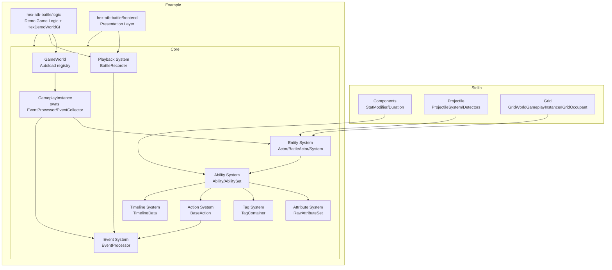

# Logic Game Framework — Architecture Overview

Godot 回合制 / ATB 战斗框架的核心模块依赖与数据流总览。

此文档是 LGF **架构与设计铁律**的唯一真相（两个规则之家之一；编码规则在主仓 `.claude/skills/enforcing-lgf/SKILL.md`）。单个系统的 API 细节看对应源码头部注释与 `tests/`，不另写参考文档。

---

## Core Module Dependencies


```mermaid
graph TB
    subgraph "Core"
        World[GameWorld<br/>Autoload registry]
        Instance[GameplayInstance<br/>owns EventProcessor/EventCollector]
        Entity[Entity System<br/>Actor/BattleActor/System]
        Attributes[Attribute System<br/>RawAttributeSet]
        Abilities[Ability System<br/>Ability/AbilitySet]
        Events[Event System<br/>EventProcessor]
        Actions[Action System<br/>BaseAction]
        Timeline[Timeline System<br/>TimelineData]
        Tags[Tag System<br/>TagContainer]
        Playback[Playback System<br/>BattleRecorder]
    end

    subgraph "Stdlib"
        Components[Components<br/>StatModifier/Duration]
        Projectile[Projectile<br/>ProjectileSystem/Detectors]
        Grid[Grid<br/>GridWorldGameplayInstance/IGridOccupant]
    end

    subgraph "Example"
        Core[hex-atb-battle/core<br/>Shared Events + WorldGI base]
        HexDemo[hex-atb-battle/logic<br/>Demo Game Logic + HexDemoWorldGI]
        Frontend[hex-atb-battle/frontend<br/>Presentation Layer]
    end

    World --> Instance
    Instance --> Entity
    Instance --> Events
    Entity --> Abilities
    Abilities --> Attributes
    Abilities --> Tags
    Abilities --> Actions
    Abilities --> Timeline
    Actions --> Events
    Components --> Abilities
    Projectile --> Entity
    Grid --> Entity
    Playback --> Events
    HexDemo --> World
    HexDemo --> Core
    HexDemo --> Playback
    Frontend --> Core
    Frontend --> Playback
```

## Key Data Flows

### 1. Ability Execution Flow
```
User Input → AbilityComponent.on_event()
    ↓ Check Triggers/Conditions/Costs
AbilityExecutionInstance.tick()
    ↓ Timeline keyframe triggers
Action.execute()
    ↓ Pre-Event processing (damage reduction/immunity)
Atomic operations (push event + apply state)
    ↓ Post-Event processing (thorns/lifesteal)
instance.event_collector collects (replay recording)
```

### 2. Attribute Modification Flow
```
StatModifierComponent.on_apply()
    ↓ Create AttributeModifier
RawAttributeSet.add_modifier()
    ↓ Mark dirty
Actor accesses attribute
    ↓ get_current_value()
AttributeCalculator.calculate()
    ↓ 4-layer formula calculation
Return AttributeBreakdown
```

### 3. Event Processing Flow
```
Action pushes event
    ↓
EventProcessor.process_pre_event()
    ↓ Iterate Pre Handlers
    ↓ Collect Intent (PASS/MODIFY/CANCEL)
    ↓ Apply modifications
MutableEvent returned
    ↓ Action checks if cancelled
EventProcessor.process_post_event()
    ↓ Dispatch to registered ability handlers, gated by Actor.is_event_responsive
    ↓ Trigger passive abilities
instance.event_collector.push()
```

---

## Configuration Placement (where does X go?)

| Config kind | Where | Example |
|---|---|---|
| Cast eligibility (cast 前过滤: range / faction / target kinds / LOS) | **ability metadata** + declarative query (e.g. `can_use_skill_on`) | `HexBattleSkillMetaKeys.RANGE` |
| Reactive event filter (事件到达时该不该响应) | **Condition** | `HasTagCondition` |
| Physical params (push / blocks_path) | plain data field | `CollisionProfile` |
| Action behavior (打谁 / 打多少) | Action subclass | `DamageAction` |
| Resource cost | Cost subclass | `MpCost` |

**Cast eligibility 不进 Condition** — AI / UI / tooltip 需要事前查询配置，Condition 只在事件到达时跑，不是 declarative 入口。详见 `enforcing-lgf` skill 的 `reference/cast-eligibility-vs-condition.md`。

**已配置 Condition/Cost 的 cast 前复核走 `AbilitySet.can_activate`**（激活门纯查询干跑，零副作用，返回 `{allowed, reason, failed_component_type}`，见 `AbilityActivationQuery`）——UI/AI/tooltip 复用同一份门控真相，既不 dry-run cast 流程，也不在业务层复刻冷却/资源规则；它不是把 cast 过滤搬进 Condition 的理由，metadata 路径照旧。

---

## World owns Battle

- **世界永续、战斗是过程**：`WorldGameplayInstance` 是一局游戏的载体（actor registry / systems 归它；hex 棋盘归 stdlib 子类 `GridWorldGameplayInstance`），期间发生任意多场战斗；战斗是短命的 `BattleProcedure`，**借用** world 里的 actor 而非 spawn，tick 期间直接改 actor 属性即等于写 world，结束即释放。判别标准：有状态、被外界引用的是 **Instance**；输入 → 输出 → 丢弃、中间无人引用的是 **Procedure**。战斗推进统一走 `WorldGameplayInstance.tick(dt)`：有未完成战斗时本帧独占给战斗（`BATTLE_TICKS_PER_WORLD_FRAME` 默认 INT_MAX，退化成一帧跑完），否则推世界 system；参战者打 `in_combat` tag 让 world-level system 跳过。
- **前端只观察 world**：`bind_world(world)` 一次性 hydrate 全部 actor，再订阅 mutation signal（`actor_added` / `actor_removed` / `grid_configured`）维护 view；属性变化（HP / tag）不走 signal，由 animator 消费录像 timeline 驱动表演。
- **录像**：`BattleProcedure` 持短命 `BattleRecorder`，事件统一汇入所属 world 的 `event_collector` 单队列；`finish()` 的返回值就是录像 dict `{meta, world_snapshot, timeline}`，无 version 字段（录像是短命数据，不做多版本共存；坏文件由 `BattleRecord.from_dict` 的必需字段检查直接 crash，不静默播空场）。`world_snapshot` 由世界侧 `capture_world_snapshot()` 产出、范围由 `should_record_actor()` 裁定（常驻世界借此排除 overworld 实体），recorder 只接收注入。存档序列化（`to_dict`）与录像快照是两套各有语义的 actor→dict，不合并：回放器没有规则引擎，需要含派生值的自足快照。播放侧两层命名：A 层 `Playback`（现役，只从录像 spawn 视觉 view）；B 层 `Replay`（deterministic 重算，未来不一定做，仅命名占位）。

## 设计铁律

框架演进中固化下来的不可违反约束（违反会重新引入已根治的 bug）：

- **事件响应钩子：观众由注册决定，死活由 actor 决定**：post 事件只送达订阅了它的 ability——`Ability.apply_effects` 按 component 的 trigger kind 注册、`remove_effects` 注销，`process_post_event(event_dict)` 没有观众参数；pre / post handler 按 owner 重建 context 之前都先问 `is_event_responsive(event_dict, phase)`。这个钩子是中性的，`Actor` 恒 `true`、不含任何领域语义；`BattleActor` 作为 **opt-in** 的战斗基类只提供一个默认答案（`not is_dead()`），项目层 override 说了算 —— hex 让死者仍响应自己的 death（亡语）与自己作为 target 的 damage（致死一击的荆棘）。激活请求与 grant 自投递是定向投递（`EventProcessor.DIRECT_DELIVERY_KINDS`，只经 `AbilitySet.receive_event`），不注册、不走 post 派发、也不问这个钩子。`check_death` 只按 hp 锁存一次，"留尸体还是 tick 末移除"是项目层决定。
- **Ability 状态不随死亡清除**：死亡时绝不 `revoke_ability`（那会清掉冷却 / execution / modifier，破坏复活语义）。三层分离 —— Ability 本体跟 actor 永存、pre / post handler 注册跟 ability 效果与 registry 走（`remove_effects` / `remove_actor` 注销，`end()` 时 `remove_all_handlers` 清空）、运行时响应跟 `is_event_responsive` 走。
- **grant 前先登记、owner 由 set 盖章、过期者由运行它的路径回收**：`AbilitySet.grant_ability` 断言 owner 已 `add_actor` 进 instance（post 订阅 / pre 注册 / context 的 instance 都按 owner id 反查，注册前 grant 会静默缺订阅），未登记不 grant；ability 的 `owner_actor_id` 由所在 AbilitySet 在 grant 时盖章——构造时留空即填 set 的 owner，非空必须与 set 的 owner 相同（不一致即断言），`source_actor_id` 才是允许不同的那份（buff 的施加者）。ability 在被运行的路径里 `expire()` 了自己——`tick` / `tick_executions` / 定向投递经 `_process_abilities`，post 派发在 handler 收尾——就由那条路径在同一趟里 `revoke_ability`；业务代码只在**外部移除**（净化、卸装备、换技能、护盾被伤害打碎）时显式 `revoke_ability`，死亡不 revoke（上一条）。`expire` = ability 自己宣布结束并撤效果，`revoke` = set 除名并广播，两步是无反向引用下的必然，不合并。
- **Action 内状态同步（原子性）**：一个 Action 里 push 事件 → 应用状态 → 死亡检测 → post 派发连续完成，post 反应总是基于最新状态触发；`EventCollector` 只供录像 / 表演层消费，`flush()` 不参与逻辑状态同步，**禁止**在 tick 里遍历事件回写状态。
- **core / stdlib 只认基类**：框架层拿到的是 `GameplayInstance` / `Actor`，**不得**收窄成某个项目的具体世界或 actor 类型（收窄是项目层 `world(ctx)` helper 的事）。`Actor` 中性、`BattleActor` opt-in：core 不声明 `ability_set` / `attribute_set` 字段，子类用协变返回覆盖 `get_ability_set()` / `get_attribute_set()`，框架层经 `BattleActor.ability_set_of(actor)` 取，**不做**鸭子探测。
- **core 无 grid，棋盘是 stdlib 电池**：core `WorldGameplayInstance` 不引用 ultra-grid-map，录像快照只经 `_get_map_config()` 一个钩子取地图；需要 hex 棋盘的世界继承 stdlib `GridWorldGameplayInstance`（`grid` / `configure_grid` / `configure_grid_model` / `clear_grid_footprint` 与 `actor_position_changed` / `grid_configured` / `grid_cell_changed` 三个 signal），dota2 不带。棋盘 occupant 表存 actor 引用（instance → grid → actor，与 registry 同向）：actor 离开 registry 必须同时离开棋盘（`remove_actor` 内建），死亡留尸体只调 `clear_grid_footprint`（occupant 是自己才清，overlay 不清同格别人的占用；预订按 id 扫全图）；actor 靠 `hex_position: HexCoord` 字段站上棋盘（`IGridOccupant`）。
- **事件形态**：dict 是总线 / 序列化形态（`EventCollector`、`EventProcessor` / `MutableEvent` / `receive_event` / `on_event` 的签名不切强类型）；强类型事件类是两端形态（构造走 `create()`、消费走 `from_dict()` / 字段直访），`is_match` 可选。事件类型定义归 core `GameEvent` 注册表。
- **hp 是资源，由 config 声明**：资源属性在 attribute config 里写 `"kind": "resource"` + `maxRef`（`"hp": { "kind": "resource", "baseValue": 100.0, "minValue": 0.0, "maxRef": "max_hp" }`），生成器产出 `set_hp` / `add_hp`（不再有 `set_hp_base`，也没有 breakdown）；`RawAttributeSet` 直接存值、写入时 clamp 到 `[minValue, maxRef 当前值]`、不进 modifier 管线（modifier / `set_base` 指向资源是 `assert_crash`），读取按 maxRef 当前值封顶而**不改存值**（max_hp 下降拉低 hp，回升后读值恢复——重穿装备 / Break 这类上限暂降不吞 hp）。上限变化时 hp 怎么跟（只封顶 / 随降永久削 / 按比例）是**游戏层策略**：core 只提供存值 + 封顶这个原语，别的策略在游戏层监听 `on_max_hp_changed` 或在自己的重算点 `set_hp` 写出来，不加 core 开关。stat 属性照旧 `set_*_base` + modifier；`maxRef` 只属于资源。上限只存属性名 String，**禁止**在 Actor 里用 `set_pre_change` 注入 Callable —— lambda 捕获 owner 会形成无法 GC 的闭包循环。
- **子对象回指 container 禁止强引用**：子对象指向所属 container 一律用 String id 或 `WeakRef`（`AbilityComponent._ability_ref` / `System._instance_ref` / `BattleProcedure._world`）；`BattleProcedure` 子类要具体世界类型就协变覆盖 `_get_world()`，不另存 world 字段（`world._active_battle` 强持 procedure，强回指即成环），procedure 持有的对象也只经调用参数拿 world；需要所属 instance 时按 owner id 反查（`GameWorld.get_instance_of_actor`），**不**在 AbilitySet / Ability / execution 上绑引用。context 对象（`ExecutionContext` / `AbilityLifecycleContext`）携带 `instance` 强引用，只许活在调用栈上、永不存进字段；`execution_state` 被 execution 强持有，同样不许放 instance / actor 这类 owning Object；既有的 `RecordingContext._recorder` 强引用靠 `BattleRecorder.stop_recording` / `abort_recording`（world 结束时由 `BattleProcedure.abort` 调）退订全部订阅闭包来打断；instance 自持的 `EventProcessor` / `EventCollector` 不回指 instance，processor 上的 pre / post handler 闭包只捕获 id（post handler 在 static 上下文里建，拿不到 Ability / Component / context）—— GDScript `RefCounted` 无循环 GC，字段缓存即真泄漏。
- **测试引擎按场景独立**：两种场景生命周期语义冲突（headless 的 shutdown 清场 vs UI 常驻 world）时各写一条 procedure（`SkillPreviewProcedure` vs `HexBattleProcedure`），而非硬塞兼容签名进一条引擎 —— 兼容参数会把 API 撑胖成坑。
- **View 是 state 的 reactive projection**：前端只能 `bind_world` + 订阅 mutation signal（`actor_added` / `actor_removed` / `grid_configured`）自动同步，**禁止任何 destructive 的 view 重建 API**；且只订阅生命周期 / 结构变化，属性变化（HP / tag）交给 timeline 驱动的 Animator。
- **Playback 不重建逻辑层**：A 层"录像播放"（`Playback`）只从录像 dict spawn 视觉 view、绝不 hydrate 真 Actor / AbilitySet / AttributeSet；B 层"回放"（`Replay`，deterministic 重算）未来不一定做，相关类名仅作命名占位。
- **录像顺序 = 调用栈真实顺序**：所有录像事件统一走所属 world 的 `event_collector.push()` 单一队列（Action 经 `ctx.event_collector`，录像回调经注入 recorder 的同一个 collector），**禁止**按"入口类型"分两个容器再拼接 —— callback 在同步栈里穿插触发，任何固定拼接顺序都会丢失交错信息（反例：`damage1 → grant → damage2`）。
- **Action 是共享无状态对象**：Action 执行后必须 `_verify_unchanged()`，child action 必须随父 `_freeze()`（经 `Action.execute_child` 调用），跨 tag 的临时状态放 execution-local state（`ctx.set_execution_state`，key 带 namespace）而非 Action 字段；两类 Action 的目录规则见 `enforcing-lgf/SKILL.md` §8。

## 已知债务

- 暂无。

## 源代码注释边界

- **只讲现状**，不讲"取代旧 XXX"、"原来是 callback 方案" 这类历史轨迹。历史归 git log；commit 正文列 API 变化与 why。
- 写 **why**（不变量 / 反直觉的约束 / 被某个 bug 驱动过的设计），不写 **what**（用良好命名表达）。
- 变更追溯入口是 git log（Conventional Commits，正文列 API 变化与 why）；不维护单独的变更日志文件。

## 更多文档

- 编码规则与「看哪个文件」指针表 → 主仓 `.claude/skills/enforcing-lgf/SKILL.md`
- 示例：[`example/hex-atb-battle/`](example/hex-atb-battle/)（回合制 + hex grid；示例自己的铁律见其 `README.md`）、[`example/dota2-auto-battle/`](example/dota2-auto-battle/)
